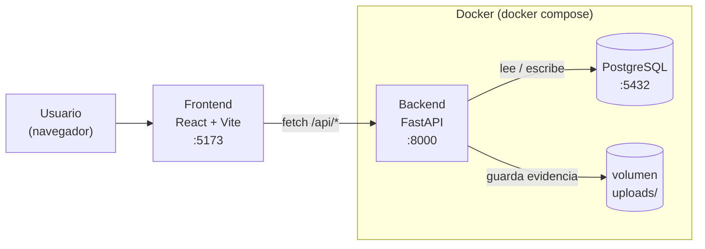

# Registro de Revisiones — Ley 21.827

Aplicación web para registrar, en un establecimiento educacional, las revisiones de pertenencias de
estudiantes conforme a la Ley 21.827: quién estuvo presente, qué se encontró, cuándo ocurrió, y un
documento imprimible como respaldo.

## Qué hace

- **Registrar una revisión**: formulario guiado paso a paso (estudiante, funcionarios presentes,
  motivo, elementos encontrados, horario, foto opcional).
- **Ver el detalle y descargar el documento**: copia lista para imprimir o entregar al apoderado.
- **Consultar**: buscar revisiones por estudiante, curso, motivo o fecha.
- **Estadísticas**: totales y desgloses por mes, motivo y curso.

## Arquitectura



## Cómo levantarlo

### Con Docker (más simple)

```bash
docker compose up --build backend
```

Backend en http://localhost:8000 (documentación interactiva en `/docs`).

### Sin Docker

```bash
# Backend
cd backend
python -m venv .venv
.venv\Scripts\activate
pip install -r requirements.txt
copy .env.example .env
uvicorn app.main:app --reload

# Frontend, en otra terminal
cd frontend
npm install
npm run dev
```

Frontend en http://localhost:5173.

## Probarlo con datos de ejemplo

```bash
cd backend
.venv\Scripts\python.exe scripts\seed.py
```

Crea 30 revisiones de ejemplo para ver Consulta y Estadísticas con contenido real.

## Tests y cobertura

El backend usa `pytest` con el plugin `pytest-cov`. La configuración vive en `backend/pytest.ini`
y exige que al menos el **60%** de las líneas de `app/` estén cubiertas por tests:

```ini
[pytest]
testpaths = tests
pythonpath = .
addopts = --cov=app --cov-report=term-missing --cov-fail-under=60
```

Si la cobertura cae debajo de ese umbral, `pytest` termina con error — tanto en tu máquina como en CI.

```bash
cd backend
pip install -r requirements-dev.txt
pytest
```

| Módulo | Qué prueba |
| --- | --- |
| `tests/test_api.py` | Salud de la API, CORS, configuración |
| `tests/test_registros.py` | Crear, listar y ver el detalle de una revisión; validaciones (RUT, horarios, evidencia) |
| `tests/test_consultas.py` | Filtros de búsqueda (estudiante, curso, motivo, fechas) |
| `tests/test_estadisticas.py` | Totales y desgloses por mes, motivo y curso |

## Integración continua

En cada `push` a `main` o `pull request`, GitHub Actions (`.github/workflows/ci.yml`) corre tres
verificaciones en paralelo. Si alguna falla, queda marcada en rojo en el PR.

| Job | Qué hace |
| --- | --- |
| Backend tests y cobertura | Corre `pytest` con Python 3.13 y exige el 60% de cobertura mínimo |
| Imagen Docker del backend | Construye la imagen y hace un smoke test contra `/api/salud` |
| Build del frontend | Compila TypeScript y genera el build de producción con Vite |
