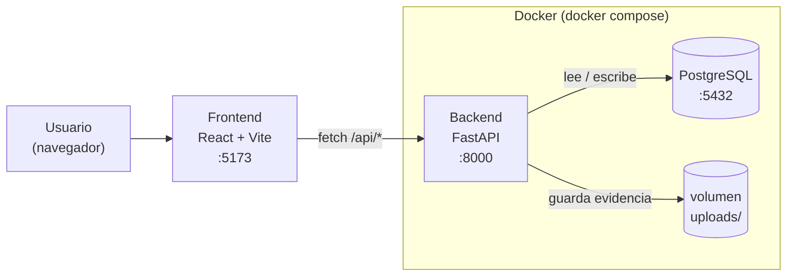

# Registro de Revisiones — Ley 21.827

Aplicación web para registrar, en un establecimiento educacional, las revisiones de pertenencias de
estudiantes conforme a la Ley 21.827: quién estuvo presente, qué se encontró, cuándo ocurrió, y un
documento imprimible como respaldo.

## Qué hace

- **Registrar una revisión**: formulario guiado paso a paso (estudiante, funcionarios presentes,
  motivo, elementos encontrados, horario, foto opcional).
- **Ver el detalle y descargar el documento**: copia lista para imprimir o entregar al apoderado.
- **Consultar**: buscar revisiones por estudiante, curso, motivo o fecha.
- **Estadísticas**: totales y desgloses por mes, motivo y curso.

## Arquitectura


```mermaid
flowchart LR
    Usuario["Usuario<br/>(navegador)"] --> Frontend["Frontend<br/>React + Vite<br/>:5173"]
    Frontend -- "fetch /api/*" --> Backend

    subgraph Docker["Docker (docker compose)"]
        Backend["Backend<br/>FastAPI<br/>:8000"]
        DB[("PostgreSQL<br/>:5432")]
        Uploads[("volumen<br/>uploads/")]
        Backend -- "lee / escribe" --> DB
        Backend -- "guarda evidencia" --> Uploads
    end

```

## Autenticación

Hay dos roles: **admin** y **funcionario**. Las rutas `/api/registros` y `/api/estadisticas`
exigen un token Bearer (login en `POST /api/auth/login`); `/api/salud` y la documentación
siguen públicas. Cerrar sesión es `POST /api/auth/logout` y el cliente descarta el token.
Crear usuarios adicionales es `POST /api/auth/usuarios` y solo lo puede hacer un **admin**.

Usuarios de prueba (créalos con):

```bash
docker compose exec backend python scripts/seed_usuarios.py
```

| Usuario      | Contraseña       | Rol          |
| ---          | ---              | ---          |
| `admin`      | `admin123`       | administrador|
| `funcionario`| `funcionario123` | funcionario  |

## Cómo levantarlo

### Con Docker (recomendado)

**Primera vez / arranque limpio** (borra la base de datos y vuelve a crearla):

```bash
docker compose down -v          # ⚠️ solo si quieres limpiar la BD (borra volúmenes)
docker compose up --build -d    # levanta backend + PostgreSQL en segundo plano
docker compose exec backend python scripts/seed_usuarios.py   # crea usuarios admin/funcionario
docker compose exec backend python scripts/seed.py            # (opcional) datos de prueba: 30 registros
```

**Arranque diario** (mantiene los datos):

```bash
docker compose up -d            # levanta contenedores existentes
```

Backend en http://localhost:8000 (documentación interactiva en `/docs`).

```bash
# Frontend, en otra terminal
cd frontend
npm install
npm run dev
```

Frontend en http://localhost:5173.

## Probarlo con datos de ejemplo

Con el backend ya corriendo:

```bash
docker compose exec backend python scripts/seed.py
```

Crea 7 estudiantes, 5 funcionarios y 30 revisiones aleatorias. Se puede repetir para agregar más datos.

## Tests y cobertura

El backend usa `pytest` con el plugin `pytest-cov`. La configuración vive en `backend/pytest.ini`
y exige que al menos el **60%** de las líneas de `app/` estén cubiertas por tests:

```ini
[pytest]
testpaths = tests
pythonpath = .
addopts = --cov=app --cov-report=term-missing --cov-fail-under=60
```

Si la cobertura cae debajo de ese umbral, `pytest` termina con error — tanto en tu máquina como en CI.

```bash
cd backend
pip install -r requirements-dev.txt
pytest
```

| Módulo | Qué prueba |
| --- | --- |
| `tests/test_api.py` | Salud de la API, CORS, configuración |
| `tests/test_registros.py` | Crear, listar y ver el detalle de una revisión; validaciones (RUT, horarios, evidencia) |
| `tests/test_consultas.py` | Filtros de búsqueda (estudiante, curso, motivo, fechas) |
| `tests/test_estadisticas.py` | Totales y desgloses por mes, motivo y curso |

## Integración continua

En cada `push` a `main` o `pull request`, GitHub Actions (`.github/workflows/ci.yml`) corre tres
verificaciones en paralelo. Si alguna falla, queda marcada en rojo en el PR.

| Job | Qué hace |
| --- | --- |
| Backend tests y cobertura | Corre `pytest` con Python 3.13 y exige el 60% de cobertura mínimo |
| Imagen Docker del backend | Construye la imagen y hace un smoke test contra `/api/salud` |
| Build del frontend | Compila TypeScript y genera el build de producción con Vite |
